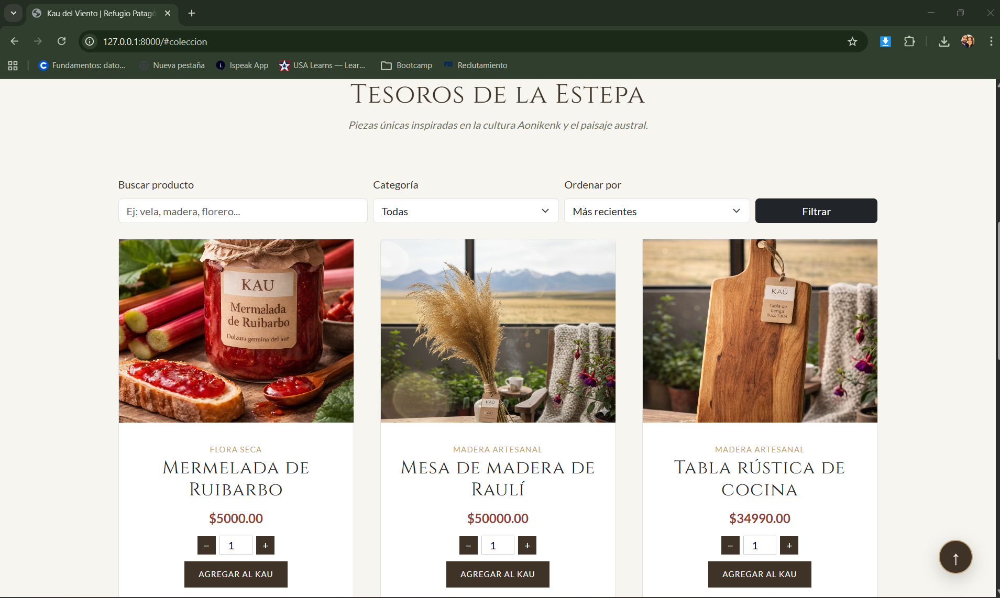
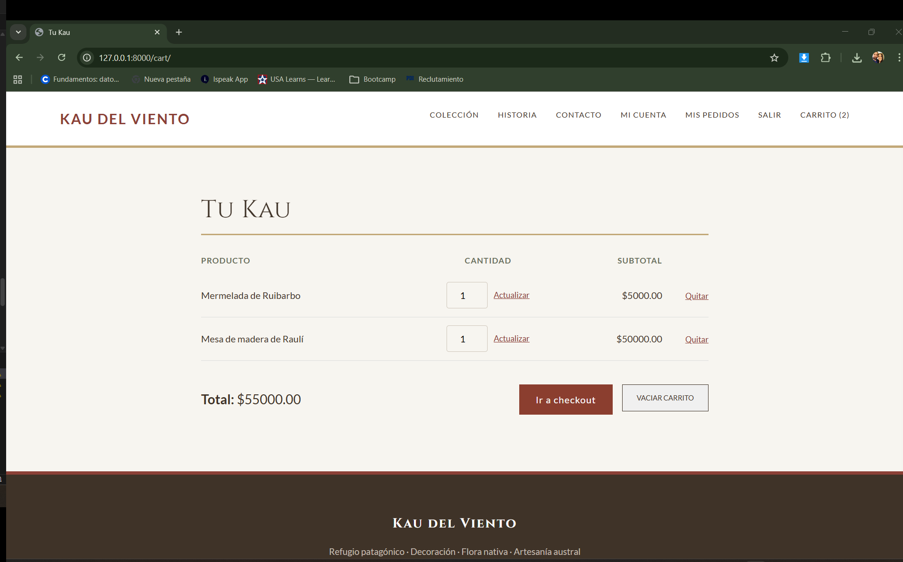
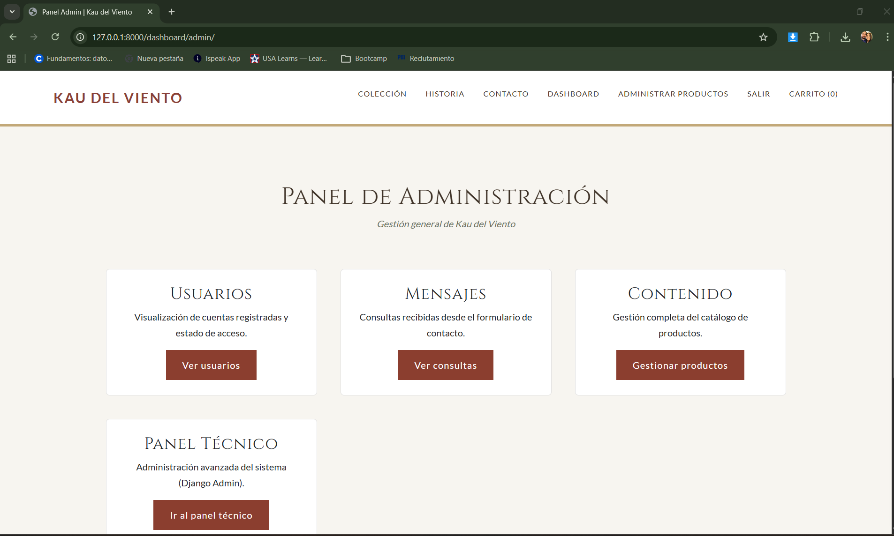

# Kau del Viento — E-commerce (Django + PostgreSQL)   

Aplicación web de comercio desarrollada con **Python**, **Django** y **PostgreSQL**.  
Incluye catálogo persistente (ORM), carrito por sesión, flujo de compra completo y gestión administrativa de productos con control de acceso por rol.

Repositorio: https://github.com/xgarridoig-jpg/kau-del-viento  
Portafolio: https://xgarridoig-jpg.github.io/

---

## Propósito

Entregar un e-commerce listo para ejecución local, con flujo principal completo **catálogo → carrito → confirmación**, y documentación clara para revisión en GitHub.

---

## Alcance (MVP)

### 2.1 Autenticación y acceso

**Usuario (cliente)**
- iniciar sesión
- acceder al catálogo
- operar el carrito (agregar, actualizar, quitar, vaciar)
- realizar compra (checkout)
- revisar pedidos en “Mis pedidos”

**Administrador (staff)**
- iniciar sesión
- acceder a un área de administración
- gestionar productos (crear/editar/eliminar)
- revisar pedidos desde el admin

---

### 2.2 Catálogo y persistencia (ORM + PostgreSQL)

- Catálogo de productos mostrado desde **PostgreSQL** mediante **Django ORM**
- Productos persistidos y editables por administrador (CRUD)
- Relación **Producto → Categoría**
- Catálogo público con:
  - búsqueda por nombre
  - filtro por categoría
  - orden por precio / nombre
  - paginación

---

### 2.3 Carrito y compra (flujo completo)

**Carrito funcional (cliente)**
- agregar productos
- quitar productos
- actualizar cantidades
- vaciar carrito
- mostrar subtotales y total correcto

**Confirmación de compra**
- registra una orden (**Pedido**) con sus ítems (**PedidoItem**)
- asocia la orden al usuario autenticado
- limpia el carrito al confirmar

---

### 2.4 Vistas y navegación

- Frontend consistente y navegación clara entre:
  - catálogo (home/colección)
  - carrito
  - login/logout
  - administración de productos (solo admin)
  - detalle de producto (si existe)

---

### 2.5 Validaciones y mensajes

- Validaciones básicas en formularios:
  - campos requeridos
  - precio > 0
  - cantidades > 0
- Mensajes claros de éxito/error para guiar al usuario

---

## Funcionalidades destacadas

### Autenticación y roles
- Registro de usuarios
- Login / Logout
- Control de acceso por rol:
  - **Cliente**: catálogo, carrito, checkout y pedidos
  - **Administrador (staff)**: CRUD de productos y administración

### Pedidos
- Estados de pedido gestionables desde admin
- Vista “Mis pedidos” para clientes autenticados
- Acceso restringido a confirmación por usuario (404 si no corresponde)

---

## Stack técnico
- **Python**
- **Django**
- **PostgreSQL**
- Django ORM
- HTML/CSS (estilos propios) + Bootstrap (parcial)
- Git / GitHub

---

## Requisitos
- Python 3.x
- PostgreSQL 14+ (recomendado)
- Git

Dependencias declaradas en:
- `kau/requirements.txt`

---

## Instalación y ejecución local

> Importante: el proyecto Django se ejecuta desde la carpeta `kau/` (ahí vive `manage.py`).

### 1) Clonar repositorio
```bash
git clone https://github.com/xgarridoig-jpg/kau-del-viento.git
cd kau-del-viento
```

### 2) Crear y activar entorno virtual

**Windows (PowerShell)**

```bash
python -m venv venv
venv\Scripts\activate
```

**macOS / Linux**

```bash
python3 -m venv venv
source venv/bin/activate
```

### 3) Instalar dependencias (requirements.txt)

```bash
cd kau
pip install -r requirements.txt
```

### 4) Configurar base de datos PostgreSQL

Crea una base de datos y un usuario en PostgreSQL (ejemplo):

* DB: `kau_del_viento`
* USER: `kau_user`
* PASSWORD: (la que definas)
* HOST: `localhost`
* PORT: `5432`

Luego ajusta la configuración en `kau/settings.py` (bloque `DATABASES`) si tu entorno usa otros valores.

### 5) Migraciones

```bash
python manage.py makemigrations
python manage.py migrate
```

### 6) Crear usuario administrador (si no existe)

```bash
python manage.py createsuperuser
```

### 7) Ejecutar servidor

```bash
python manage.py runserver
```

App disponible en:

* [http://127.0.0.1:8000/](http://127.0.0.1:8000/)

---

## Rutas principales

### Público

* `/` → Home (catálogo público en sección colección)
* `/contacto/` → Contacto

### Autenticación

* `/accounts/signup/` → Registro
* `/accounts/login/` → Login
* `/accounts/logout/` → Logout

### Carrito y compra

* `/cart/` → Carrito (Tu Kau)
* `/orders/checkout/` → Checkout (requiere login)
* `/orders/success/<order_id>/` → Confirmación (requiere login, acceso restringido por usuario)
* `/orders/mis-pedidos/` → Historial del usuario

### Administración (solo staff)

* `/products/` → Listado de productos (admin)
* `/products/create/` → Crear producto
* `/products/edit/<id>/` → Editar producto
* `/products/delete/<id>/` → Eliminar producto
* `/admin/` → Admin Django (gestión completa)

---

## Credenciales de prueba

> Para demostración se recomienda mantener **1 ADMIN** y **1 CLIENTE** listos.

### Administrador (staff)

* usuario: `admin`
* contraseña: `admin123`

### Cliente

* usuario: `cliente_test`
* contraseña: `Pass1234`

Si en tu entorno no existen, créalos desde:

* `/admin/` (como superuser) o
* `python manage.py createsuperuser` (para admin)

---

## Capturas (evidencias)


### Home / Catálogo



### Carrito



### Admin



### Evidencias adicionales (carpeta)

* `kau/docs/`

---

## Nota de seguridad (entorno local)

## Nota (ejecución local)

El proyecto está configurado para ejecutarse en local.  
Si se despliega en un servidor, se recomienda desactivar `DEBUG`, configurar `ALLOWED_HOSTS` y gestionar **credenciales** y **archivos subidos (media)** de forma segura.

---

## Proyección del proyecto

La estructura actual permite extender el sistema hacia funcionalidades como:

* gestión de inventario (stock por producto) y disponibilidad
* cupones y reglas de descuento (por categoría o por total de compra)
* integración de pasarela de pago (Stripe / Mercado Pago) con webhooks para confirmar pagos y actualizar el estado del pedido
* seguimiento de pedidos (tracking) y notificaciones por correo
* reportes administrativos (ventas por periodo, productos más vendidos)
* panel administrativo de pedidos (filtros por estado, fechas y usuario)

---

## Autora

**Ximena Garrido** — Backend Developer

Portafolio: [https://xgarridoig-jpg.github.io/](https://xgarridoig-jpg.github.io/)
LinkedIn: [https://www.linkedin.com/in/xpgarrido/](https://www.linkedin.com/in/xpgarrido/)


