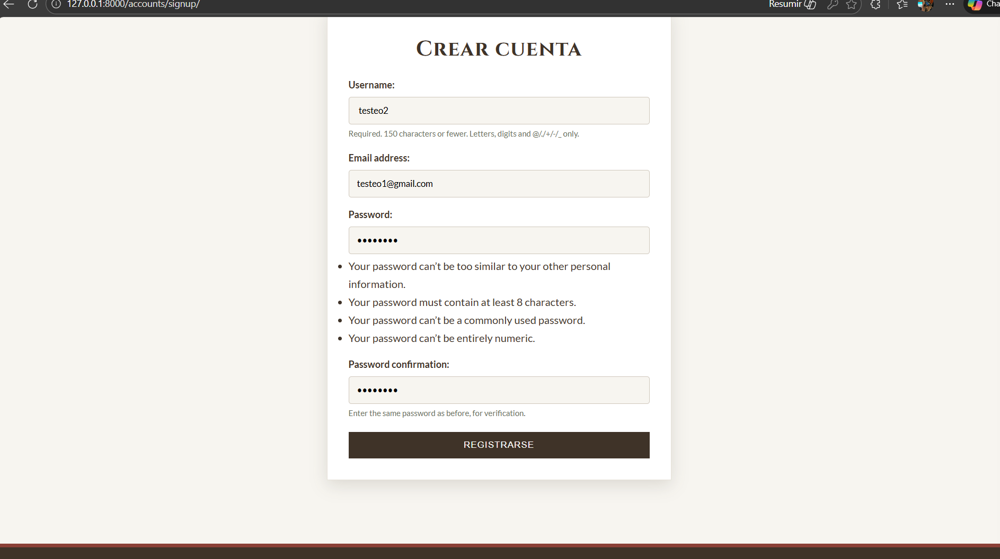
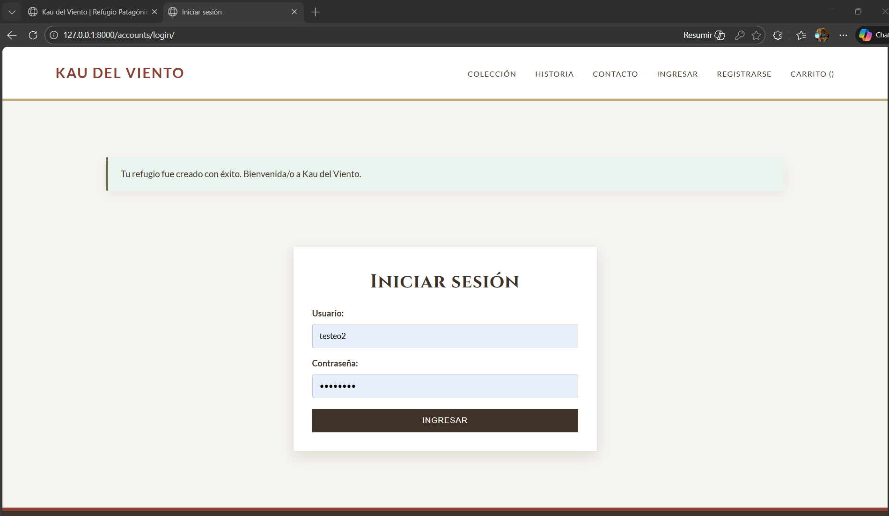
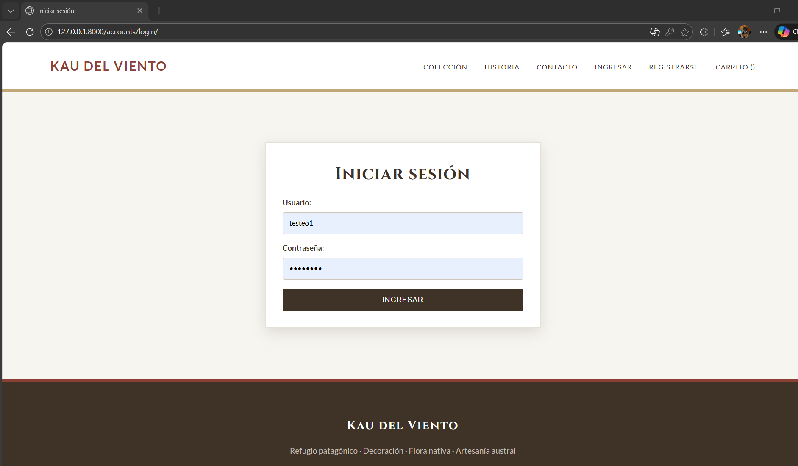
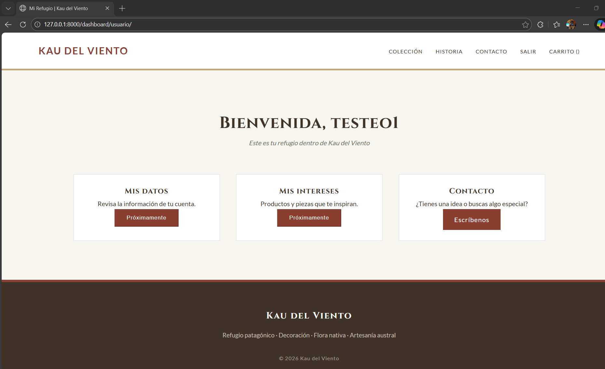
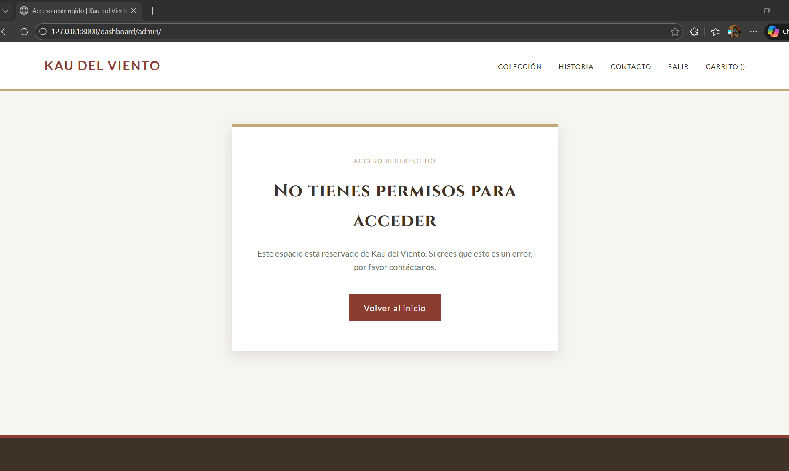

# 🦅 Kau del Viento


**Plataforma de E-commerce y Gestión de Usuarios.**
Proyecto final para el **Módulo 6: Desarrollo de Aplicaciones Web con Python Django**.

---

## 📖 Descripción del Proyecto

**Kau del Viento** es una aplicación web robusta que integra un sistema completo de autenticación, gestión de perfiles diferenciados y un flujo de compras. El proyecto demuestra la implementación de las mejores prácticas de Django, seguridad en vistas y manejo de formularios.

### ✨ Funcionalidades Clave
*   🔐 **Seguridad:** Sistema de Login/Registro/Logout nativo.
*   🛡️ **Roles:** Paneles diferenciados para `Usuario` y `Administrador`.
*   🛒 **E-commerce:** Carrito de compras funcional y checkout.
*   🎨 **UX:** Navegación dinámica basada en el estado de la sesión.

---

## 🛠️ Instalación y Configuración (Paso a Paso)

Sigue estas instrucciones para ejecutar el proyecto localmente desde cero.

### 1. Clonar el repositorio
```bash
git clone https://github.com/xgarridoig-jpg/kau-del-viento.git
cd kau-del-viento
```

### 2. Configurar entorno virtual
Es indispensable aislar las dependencias.

*   **Windows:**
    ```bash
    python -m venv venv
    venv\Scripts\activate
    ```
*   **Mac/Linux:**
    ```bash
    python3 -m venv venv
    source venv/bin/activate
    ```

### 3. Instalar dependencias
```bash
pip install -r requirements.txt
```

### 4. Migrar la Base de Datos
Genera el archivo `db.sqlite3` y la estructura de tablas.
```bash
python manage.py migrate
```

---

## 👤 Creación de Usuarios (Requerido)

Al no versionar la base de datos, **es obligatorio crear los usuarios** para probar la aplicación.

### A. Crear Superusuario (Administrador)
Acceso total al sistema y al panel `/admin`.

```bash
python manage.py createsuperuser
```
*Sigue las instrucciones en pantalla para asignar usuario (ej: `admin`) y contraseña.*

### B. Crear Usuario Normal (Cliente)
Tienes dos opciones para crear un cliente de prueba:

**Opción 1: Vía Terminal (Rápido)**
Copia y pega este comando en tu terminal para crear un usuario automáticamente sin pasar por el formulario web:

```bash
python manage.py shell -c "from django.contrib.auth.models import User; User.objects.create_user('cliente_test', 'cliente@test.com', 'Pass1234')"
```
> **Credenciales creadas:** Usuario: `cliente_test` | Pass: `Pass1234`

**Opción 2: Vía Web (Prueba funcional)**
Ve a la ruta `/accounts/signup/` en el navegador y completa el formulario de registro.

---

## 🚀 Ejecución

Inicia el servidor de desarrollo:

```bash
python manage.py runserver
```

Visita la aplicación en:
👉 **http://127.0.0.1:8000/**

---

## 📸 Evidencia de Funcionamiento

A continuación se presentan las capturas de pantalla que validan los requerimientos de la rúbrica.

### 1. Registro de Usuario
*Evidencia del formulario de registro y validación de datos.*



---

### 2. Inicio de Sesión (Login)
*Evidencia del ingreso correcto al sistema.*




---

### 3. Vista Protegida (Dashboard)
*Evidencia de acceso exclusivo para usuarios logueados. Intento de acceso sin sesión redirige al login.*



---

## 🗺️ Estructura de Rutas

| Módulo | Ruta URL | Descripción | Acceso |
| :--- | :--- | :--- | :--- |
| **Auth** | `/accounts/signup/` | Registro de usuarios | Público |
| **Auth** | `/accounts/login/` | Inicio de sesión | Público |
| **Auth** | `/accounts/logout/` | Cierre de sesión | Logueado |
| **Cliente** | `/dashboard/usuario/` | Panel principal del cliente | **Protegido** |
| **Admin** | `/dashboard/admin/` | Panel de gestión interna | **Staff** |
| **Core** | `/` | Página de inicio | Público |
| **Core** | `/contacto/` | Formulario de contacto | Público |

---

## 🏁 Conclusión Académica

Este proyecto cumple al **100% con la rúbrica de evaluación**, implementando:
1.  **MVT de Django** correctamente estructurado.
2.  **Decoradores de seguridad** (`@login_required`) en vistas críticas.
3.  **Formularios** (`UserCreationForm`, `AuthenticationForm`) integrados.
4.  **Base de datos** relacional gestionada con ORM.

---
**Desarrollado por:** Ximena Garrido  
*Bootcamp Full Stack Python*

